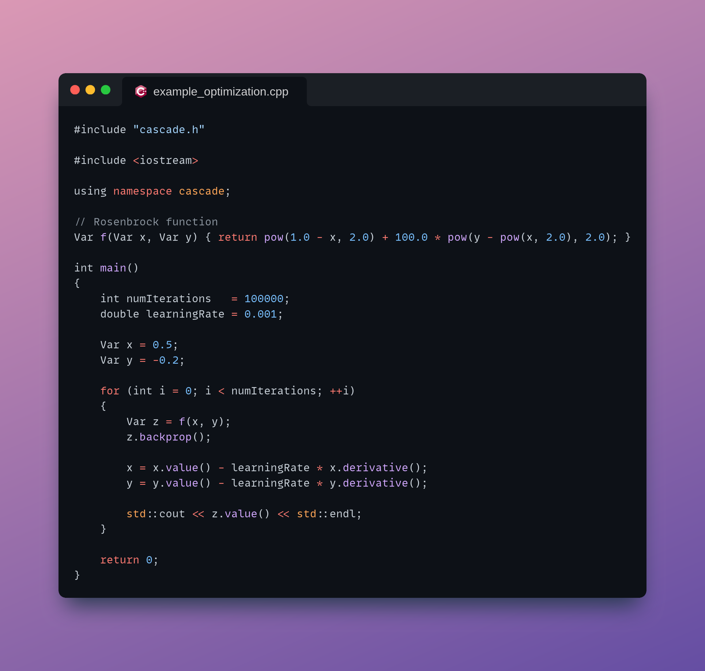
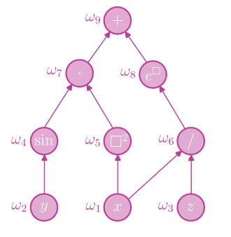
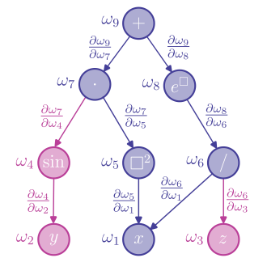

<div align="center">
    
</div>

<p div align="center">
    <b>A minimal engine for automatic differentiation</b>
</p>

<p align="center">
    <a href="https://github.com/marcromani/cascade/actions/workflows/ubuntu.yml"></a>
    <a href="https://github.com/marcromani/cascade/actions/workflows/windows.yml"></a>
    <a href="https://codecov.io/gh/marcromani/cascade"></a>
    <a href="./LICENSE"></a>
</p>

#

**Cascade** is a lightweight C++ library for automatic differentiation and error propagation. It provides a streamlined engine to compute gradients of arbitrary functions and propagate uncertainties in the inputs to the outputs. The library simplifies the implementation of gradient-based optimization algorithms and the error analysis in scientific computing and engineering applications.

<p align="center">
    <br>
    
    <br>
</p>

## How to build

Create a `build` folder in the root directory and `cd` it. Build the library and tests executable with:

```
cmake -DCMAKE_BUILD_TYPE=Release ..
cmake --build .
```

The library is built in `build/src` and the tests executable in `build/tests`.

## How to install

To further install the library do:

```
cmake --build . --target install
```

If you want to install the library in a custom directory set the install path first:

```
cmake -DCMAKE_BUILD_TYPE=Release -DCMAKE_INSTALL_PREFIX=/your/install/path ..
cmake --build . --target install
```

The installation folder has the following structure:

```
/your/install/path
├── bin
│   ├── example_covariances
│   ├── example_derivatives
│   ├── example_optimization
│   └── run_tests
├── include
│   ├── cascade.h
│   ├── functions.h
│   └── var.h
└── lib
    ├── libcascade_shared.so
    └── libcascade_static.a
```

To use Cascade in your project simply include the `cascade.h` header file and link against the library.

## Examples

*example_derivatives.cpp*

```cpp
#include "cascade.h"

#include <iostream>

using namespace cascade;

int main()
{
    Var x = 2.5;
    Var y = 1.2;
    Var z = 3.7;

    Var f = pow(x, 2.0) * sin(y) * exp(x / z);

    // Propagate the derivatives downstream
    f.backprop();

    // Recover the partial derivatives from the leaf nodes
    double fx = x.derivative();
    double fy = y.derivative();
    double fz = z.derivative();

    std::cout << "Value of f: " << f.value() << std::endl;
    std::cout << "Gradient of f: (" << fx << " " << fy << " " << fz << ")" << std::endl;

    return 0;
}
```

```
g++ example_derivatives.cpp -o example_derivatives -I/your/install/path/include -L/your/install/path/lib -lcascade_static
```

```
./example_derivatives
Value of f: 11.4487
Gradient of f: (12.2532 4.45102 -2.09071)
```

*example_covariances.cpp*

```cpp
#include "cascade.h"

#include <iostream>

using namespace cascade;

int main()
{
    // Create variables by providing their values and standard deviations (default to 0.0)
    Var x = {2.1, 1.5};
    Var y = {-3.5, 2.5};
    Var z = {5.7, 1.4};

    // Set the covariances between them (default to 0.0)
    Var::setCovariance(x, y, 0.5);
    Var::setCovariance(x, z, 1.8);
    Var::setCovariance(y, z, -1.0);

    // Compute a function of the variables
    Var f = (x + y) * cos(z) * x;

    bool changed = Var::setCovariance(f, x, 1.0);

    if (!changed)
    {
        std::cout << "Covariance involving a functional variable cannot be set" << std::endl;
    }

    // Computing covariances involving functional variables triggers backpropagation calls
    std::cout << Var::covariance(f, x) << std::endl;
    std::cout << Var::covariance(f, y) << std::endl;
    std::cout << Var::covariance(f, z) << std::endl;

    std::cout << Var::covariance(f, f) << std::endl;
    std::cout << f.sigma() * f.sigma() << std::endl;

    return 0;
}
```

```
g++ example_covariances.cpp -o example_covariances -I/your/install/path/include -L/your/install/path/lib -lcascade_static
```

```
./example_covariances
Covariance involving a functional variable cannot be set
-0.723107
12.8668
-3.87443
28.4044
28.4044
```

## Background

### Automatic differentiation

Cascade uses reverse mode automatic differentiation, most commonly known as backpropagation, to compute exact derivatives of arbitrary piecewise differentiable functions. The key concept behind this technique is compositionality. Each function defines an acyclic computational graph where its nodes store the intermediate values of the operations that make up the result, and each edge stores the derivative of a parent node with respect to a child node. One can then efficiently apply the chain rule on the function by sorting the graph nodes in a topological order and allowing the derivatives to flow backwards, from the output to the inputs. For example, the graph of $x^2 \sin{y} + e^{x/z}$ has the form:

<div align="center">
    <picture>
        <source media="(prefers-color-scheme: light)" srcset="./media/graph_light.png">
        
    </picture>
</div>

Here each node is given a name and is already indexed following a topological order. The partial derivative of the function with respect to $x$ corresponds to adding all the paths from the output node to the $x$ node, where the value of each path is the product of the values of its edges:

<div align="center">
    <picture>
        <source media="(prefers-color-scheme: light)" srcset="./media/derivative_graph_light.png">
        
    </picture>
</div>

Formally,

```math
\begin{align*}
\frac{\partial\omega_9}{\partial x} = & \, \frac{\partial\omega_9}{\partial\omega_7}\frac{\partial\omega_7}{\partial x} + \frac{\partial\omega_9}{\partial\omega_8}\frac{\partial\omega_8}{\partial x} \\
= & \, \frac{\partial\omega_9}{\partial\omega_7} \left(\frac{\partial\omega_7}{\partial\omega_4}\frac{\partial\omega_4}{\partial x} + \frac{\partial\omega_7}{\partial\omega_5}\frac{\partial\omega_5}{\partial x}\right) + \frac{\partial\omega_9}{\partial\omega_8}\left(\frac{\partial\omega_8}{\partial\omega_6}\frac{\partial\omega_6}{\partial x}\right) \\
= & \, \frac{\partial\omega_9}{\partial\omega_7} \left(\frac{\partial\omega_7}{\partial\omega_4}\left(\frac{\partial\omega_4}{\partial\omega_2}\frac{\partial\omega_2}{\partial x}\right) + \frac{\partial\omega_7}{\partial\omega_5}\left(\frac{\partial\omega_5}{\partial\omega_1}\frac{\partial\omega_1}{\partial x}\right)\right) + \frac{\partial\omega_9}{\partial\omega_8}\left(\frac{\partial\omega_8}{\partial\omega_6}\left(\frac{\partial\omega_6}{\partial\omega_1}\frac{\partial\omega_1}{\partial x} + \frac{\partial\omega_6}{\partial\omega_3}\frac{\partial\omega_3}{\partial x}\right)\right) \\
= & \, \frac{\partial\omega_9}{\partial\omega_7} \left(\frac{\partial\omega_7}{\partial\omega_4}\left(\frac{\partial\omega_4}{\partial\omega_2}\cdot0\right) + \frac{\partial\omega_7}{\partial\omega_5}\left(\frac{\partial\omega_5}{\partial\omega_1}\cdot1\right)\right) + \frac{\partial\omega_9}{\partial\omega_8}\left(\frac{\partial\omega_8}{\partial\omega_6}\left(\frac{\partial\omega_6}{\partial\omega_1}\cdot1 + \frac{\partial\omega_6}{\partial\omega_3}\cdot0\right)\right) \\
= & \, \frac{\partial\omega_9}{\partial\omega_7}\frac{\partial\omega_7}{\partial\omega_5}\frac{\partial\omega_5}{\partial\omega_1} + \frac{\partial\omega_9}{\partial\omega_8}\frac{\partial\omega_8}{\partial\omega_6}\frac{\partial\omega_6}{\partial\omega_1}\,.
\end{align*}
```

### Error propagation

If you have a set of $n$ distinct variables with values $\mu_1, \ldots, \mu_n$, which come with some errors that you can estimate, $\sigma_1, \ldots, \sigma_n$, together with the size of the correlations between the variables, $\sigma_{ij}$, you can model your data as a sample of a random vector $\boldsymbol{X} = (X_1, \ldots, X_n)$ with expected value

```math
\text{E}\left[\boldsymbol{X}\right] = (\text{E}\left[X_1\right], \ldots, \text{E}\left[X_n\right]) = (\mu_1, \ldots, \mu_n) = \boldsymbol{\mu}
```

and covariance matrix

```math
\text{Cov}\left[\boldsymbol{X}\right] = \left(\begin{matrix}\text{Cov}\left[X_1, X_1\right] & \text{Cov}\left[X_1, X_2\right] & \cdots & \text{Cov}\left[X_1, X_n\right] \cr \text{Cov}\left[X_2, X_1\right] & \text{Cov}\left[X_2, X_2\right] & \cdots & \text{Cov}\left[X_2, X_n\right] \cr \vdots & \vdots & \ddots & \vdots \cr \text{Cov}\left[X_n, X_1\right] & \text{Cov}\left[X_n, X_2\right] & & \text{Cov}\left[X_n, X_n\right]\end{matrix}\right) = \left(\begin{matrix}{\sigma_1}^2 & \sigma_{12} & \cdots & \sigma_{1n} \cr \sigma_{21} & {\sigma_2}^2 & \cdots & \sigma_{2n} \cr \vdots & \vdots & \ddots & \vdots \cr \sigma_{n1} & \sigma_{n2} & \cdots & {\sigma_{n}}^2\end{matrix}\right)\,.
```

Whenever you compute a value $Y$ that is a function of these variables, say $Y = f(\boldsymbol{X})$, their uncertainties will be propagated to the result, so that it will also be a random variable. An estimation of the error associated with this new variable can be computed by linearizing the function around the expected value of the input, $\boldsymbol{\mu}$:

```math
\begin{align*}
\text{Var}\left[Y\right] \approx & \, \text{Var}\left[f(\boldsymbol{\mu}) + {\nabla{f}(\boldsymbol{\mu})}^\top(\boldsymbol{X} - \boldsymbol{\mu})\right] \\
= & \, \text{Var}\left[{\nabla{f}(\boldsymbol{\mu})}^\top(\boldsymbol{X} - \boldsymbol{\mu})\right] \\
= & \, \text{E}\left[{\nabla{f}(\boldsymbol{\mu})}^\top(\boldsymbol{X} - \boldsymbol{\mu}){(\boldsymbol{X} - \boldsymbol{\mu})}^\top\nabla{f}(\boldsymbol{\mu})\right] \\
= & \, {\nabla{f}(\boldsymbol{\mu})}^\top\text{E}\left[(\boldsymbol{X} - \boldsymbol{\mu}){(\boldsymbol{X} - \boldsymbol{\mu})}^\top\right]\nabla{f}(\boldsymbol{\mu}) \\
= & \, {\nabla{f}(\boldsymbol{\mu})}^\top\text{Cov}\left[\boldsymbol{X}\right]\nabla{f}(\boldsymbol{\mu})\,.
\end{align*}
```

For uncorrelated variables one recovers the well-known formula for error propagation:

```math
\text{Var}\left[Y\right] \approx \sum_{i=1}^n\left({\frac{\partial f}{\partial x_i}(\boldsymbol{\mu})}\right)^2{\sigma_i}^2\,.
```

The same idea can also be used to compute the covariance between two variables that are both functions of $\boldsymbol{X}$. For instance, if $Z = g(\boldsymbol{X})$:

```math
\begin{align*}
\text{Cov}\left[Y, Z\right] = & \, \text{E}\left[(Y - f(\boldsymbol{\mu}))(Z - g(\boldsymbol{\mu}))\right] \\
\approx & \, \text{E}\left[{\nabla{f}(\boldsymbol{\mu})}^\top(\boldsymbol{X} - \boldsymbol{\mu}){\nabla{g}(\boldsymbol{\mu})}^\top(\boldsymbol{X} - \boldsymbol{\mu})\right] \\
= & \, \text{E}\left[{\nabla{f}(\boldsymbol{\mu})}^\top(\boldsymbol{X} - \boldsymbol{\mu}){(\boldsymbol{X} - \boldsymbol{\mu})}^\top\nabla{g}(\boldsymbol{\mu})\right] \\
= & \, {\nabla{f}(\boldsymbol{\mu})}^\top\text{E}\left[(\boldsymbol{X} - \boldsymbol{\mu}){(\boldsymbol{X} - \boldsymbol{\mu})}^\top\right]\nabla{g}(\boldsymbol{\mu}) \\
= & \, {\nabla{f}(\boldsymbol{\mu})}^\top\text{Cov}\left[\boldsymbol{X}\right]\nabla{g}(\boldsymbol{\mu})\,.
\end{align*}
```

You can see that computing covariances between arbitrary piecewise differentiable functions reduces to a differentiation problem.
